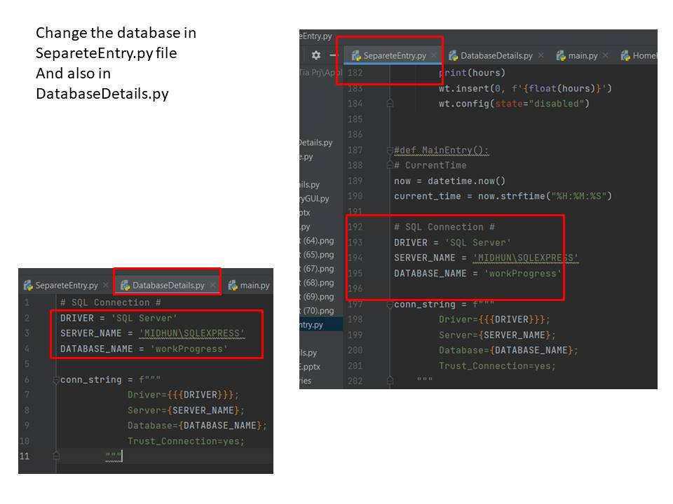
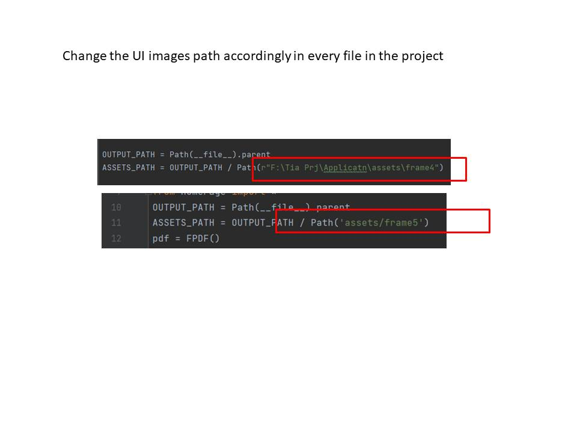
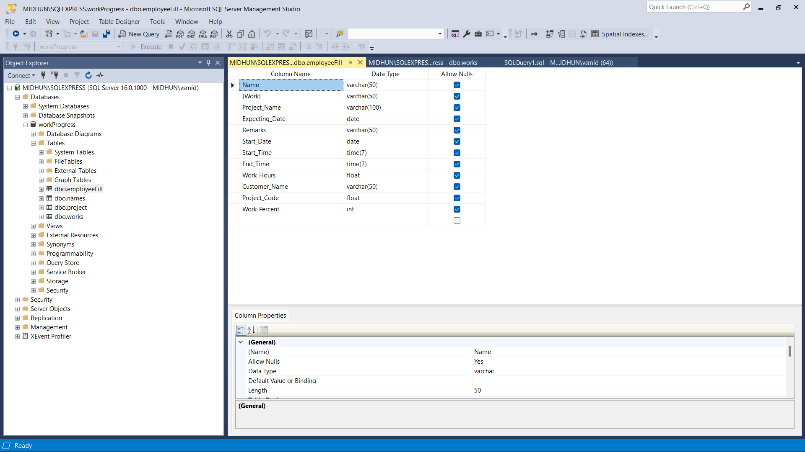
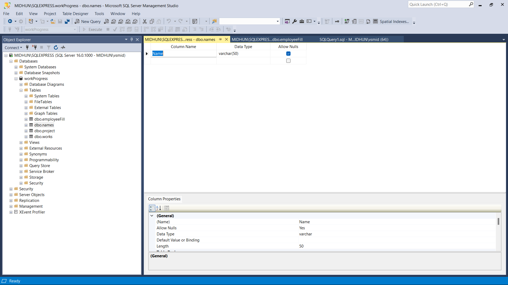
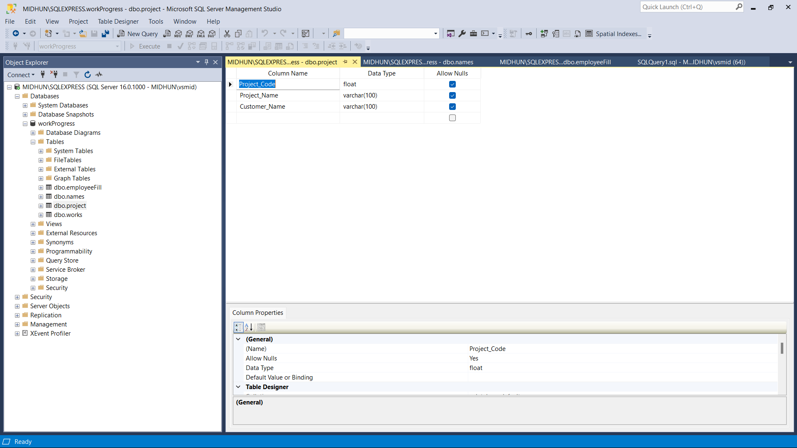
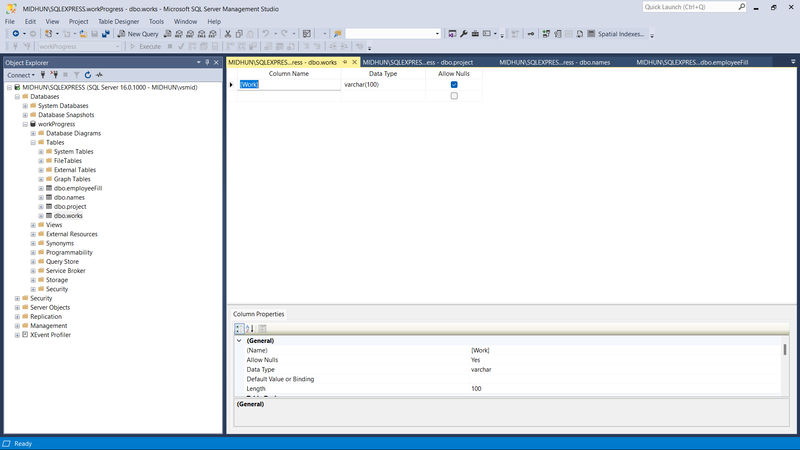

# Application To Monitor Staffs Work

# Description
The "Windows Application to Monitor Staff's Work" is a powerful and user-friendly solution designed to facilitate efficient staff management and productivity tracking in organizations. Developed using Python GUI (Tkinter) for the frontend and Microsoft SQL Server with the pypyodbc library for the backend, this application offers a comprehensive tool for monitoring, analyzing, and optimizing staff performance.

# Benefits
- Enhanced Productivity: By providing real-time monitoring and performance analysis, the application helps in identifying bottlenecks and areas where staff can be more efficient, ultimately boosting productivity.
- Data-Driven Decision Making: Managers can make informed decisions based on the data collected, improving resource allocation and task prioritization.
- Streamlined Communication: The application facilitates better communication by sending notifications and alerts, ensuring that staff are always informed about their responsibilities and targets.
- Data Integrity: Microsoft SQL Server, coupled with pypyodbc, guarantees data integrity, scalability, and reliability, ensuring that staff-related information is secure and easily retrievable.

# Demonstartion Video

https://github.com/vsmidhun21/ApplicationToMonitorStaffsWork/assets/114806736/e39db0ce-b8da-47f3-9609-68498ae33560

# Steps To Do Before Running
Step 1:

Step 2:

Step 3:
Create the Databse accordingly with the table details given below.
Don't Change the Table name and the Data Type of the coloum.
If You Change the Database Details such as table name, column name then you have to change those details inside every file in the project.
- employeeFill Table Details

Name Table Details

Project Table Details

Work Table Details

